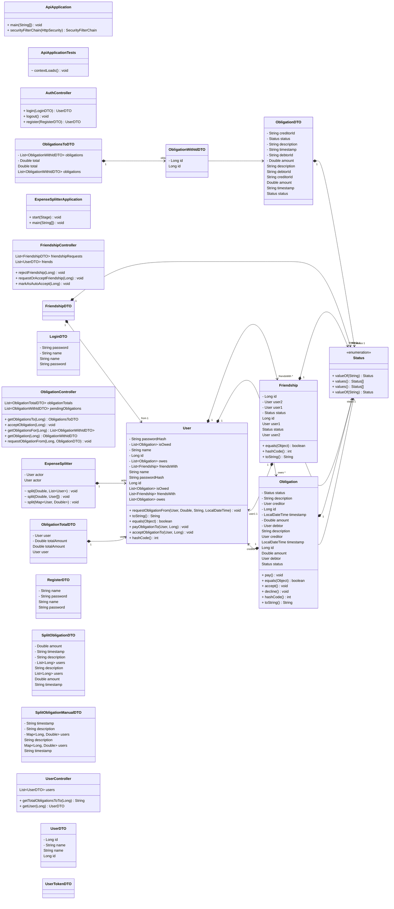

# Expense Splitter
Application for splitting expenses between multiple people.

## Project Structure

The project is divided into 3 modules:
1. library (lib): the core logic of dividing expenses and should connect to the database
2. api: the REST API that exposes the functionality of the library via HTTP interface. It's the server side of the app.
3. app: the client interface (GUI) that each user will run.

### Introduction to each part:
#### Library

The idea is to use a graph database (Neo4J) and utilize pathfinding to solve for the final debts.

There are 3 entities defined - 1 node and 2 types of edges (relationships):
- User: this is our sole node. We're assuming no email validation is needed and as such other than relationships it contains just an ID, a name and a password hash.
- Friendship: this is a relationship between 2 users. It has a status (pending, accepted, rejected or auto-accepting payment requests as a higher form of accepted.)
- Obligation: this is really the core object of this project. It has an amount, short description, status (pending, accepted, rejected or paid) and a timestamp.

Additionally, there is an ExpenseSplitter helper class for, well, dividing expenses between multiple users (e.g. when a group of friends go out to dinner and want to split the bill automatically).

#### API

The API is a Spring Boot REST application. The 4 primary routes are `/users`, `/obligations`, `/friends` and `/auth` for registration/login.

Quite a bit here will have to be implementation-defined (configurations, security, etc.) - currently it's just controllers and data transfer objects.

#### App 

The frontend in JavaFX and should use the API to get and send all data.

Ideally it'd be an android app, but that's a bit beyond this course :)

You can find a basic UI wireframe [here](https://www.tldraw.com/v/Akd_c_7v9MfgASwS_PhWTqUIPz?viewport=0%2C0%2C1920%2C947&page=page%3Ab7IZwZtfoCV7BiOXsUiDb), in the [`dics-assets/wireframe.tldraw`](docs-assets/wireframe.tldraw) file or as an svg image under [`docs-assets/wireframe.svg`](docs-assets/wireframe.svg):

### class diagram

An IntelliJ UML version from which this mermaid code was generated is also included as [`class_diagram.uml`](docs-assets/class_diagram.uml).

### Use case diagram

