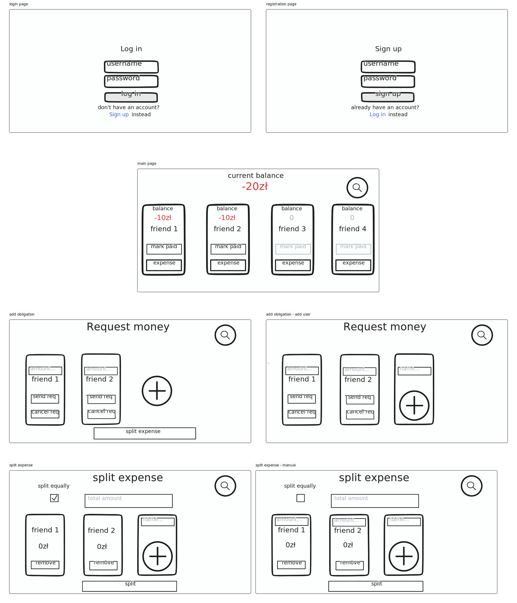
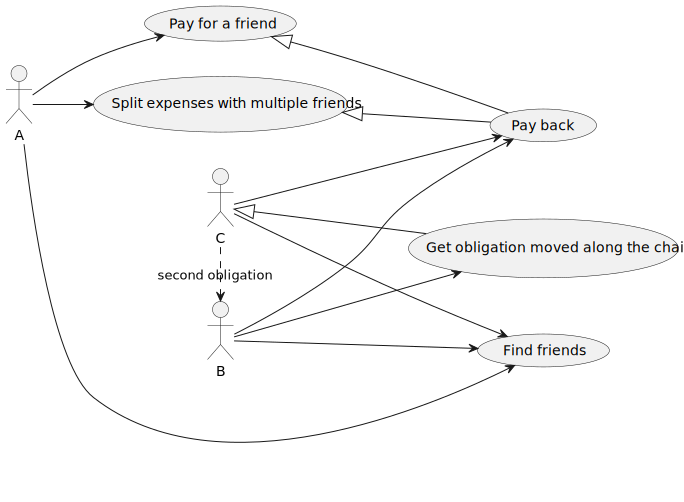

# Expense Splitter
Application for splitting expenses between multiple people.

## Project Structure

The project is divided into 3 modules:
1. library (lib): the core logic of dividing expenses and should connect to the database
2. api: the REST API that exposes the functionality of the library via HTTP interface. It's the server side of the app.
3. app: the client interface (GUI) that each user will run.

### Introduction to each part:
#### Library

The idea is to use a graph database (Neo4J) and utilize pathfinding to solve for the final debts.

There are 3 entities defined - 1 node and 2 types of edges (relationships):
- User: this is our sole node. We're assuming no email validation is needed and as such other than relationships it contains just an ID, a name and a password hash.
- Friendship: this is a relationship between 2 users. It has a status (pending, accepted, rejected or auto-accepting payment requests as a higher form of accepted.)
- Obligation: this is really the core object of this project. It has an amount, short description, status (pending, accepted, rejected or paid) and a timestamp.

Additionally, there is an ExpenseSplitter helper class for, well, dividing expenses between multiple users (e.g. when a group of friends go out to dinner and want to split the bill automatically).

#### API

The API is a Spring Boot REST application. The 4 primary routes are `/users`, `/obligations`, `/friends` and `/auth` for registration/login.

Quite a bit here will have to be implementation-defined (configurations, security, etc.) - currently it's just controllers and data transfer objects.

#### App 

The frontend in JavaFX and should use the API to get and send all data.

Ideally it'd be an android app, but that's a bit beyond this course :)

You can find a basic UI wireframe [here](https://www.tldraw.com/v/Akd_c_7v9MfgASwS_PhWTqUIPz?viewport=0%2C0%2C1920%2C947&page=page%3Ab7IZwZtfoCV7BiOXsUiDb), in the [`dics-assets/wireframe.tldraw`](docs-assets/wireframe.tldraw) file or as an svg image under [`docs-assets/wireframe.svg`](docs-assets/wireframe.svg):

### class diagram

An IntelliJ UML version from which this mermaid code was generated is also included as [`class_diagram.uml`](docs-assets/class_diagram.uml).

### Use case diagram

## Use cases (using API)
&nbsp;&nbsp;&nbsp;&nbsp;&nbsp; This note features all available API methods with 
endpoints, parameters and basic usage.  
&nbsp;&nbsp;&nbsp;&nbsp;&nbsp; All parameters are meant to be sent in JSON format.
For every method following scheme is used:
 - /end/point/method
   - POST/GET
   - parameter1, parameter2, parameter3...
   - result1, result2, result3...
### Important
For testing purpuses there is a master token, which is always valid - "MasterToken". You can use it instead of JWT token as "Bearer Token" in PostMan.
### /authorisation:
Basic idea behind implemented authorisation is to return Bearer token
whenever a user is logging in or registering. On app side destroying token when 
logging out needs implementation.
Token must be sent with every other request do API. <nl>

  - /auth/register
    - POST
    - username, password
    - token, id
  - /auth/login
    - POST
    - username, password
    - token, id

### /friend:
Methods related to friend accepting, requesting, declining etc. are presented below.
###
  With this method the current user will either send or accept
request if it's waiting to be accepted by the user.
  - /friend/user/{id}/requestoracceptfriendship/{withid}
    - GET
    - (your) id, (friends) withid, token
###
Reject pending relationship invitation. <nl>
  - /friend/user/{id}/rejectfriendship/{withid}
    - GET
    - (your) id, (friends) withid, token.
###
With this method, all future obligations between users will be automatically accepted.
  - /friend/user/{id}/auto/{withid}
    - GET
    - (your) id, (friends) withid, token
###
 Get all friends of the user.
  - /friend/user/{id}/friends
    - GET
    - (your) id, token
    - user1(name, id), user2(name, id)...
###
Get all friendship request received by the user.
  - /friend/user/{id}/requests
    - GET
    - (your) id, token
    - name
### /obligation:
Asking for money, splitting bills, accepting  or declining obligations
###
Get all obligation that user owes to others
 - /obligations/user/{id}/debts
   - GET
   - (your) id, token
   - list of((creditor) id, (debtor) id, description, amount, timestamp, status, token)
###
Get all obligation that others owes to user
 - /obligations/user/{id}/credits
    - GET
    - (your) id, token
    - list of((creditor) id, (debtor) id, description, amount, timestamp, status, token)
###
Ask for money
 - /obligations/user/{id}/request
   - POST
   - (your) id, (friend) id, description, timestamp, status, token
###
Accept single obligation from another user
 - /obligations/user/{id}/accept/{toid}/{oblid}
   - GET
   - (your) id, (friend) toid, (obligation) oblid
###
 Get both incoming and outgoing pending (waiting to be accepted by friend or you) obligations
- /obligations/user/{id}/pending
  - GET
  - (your) id
  - list of((creditor) id, (debtor) id, description, amount, timestamp, status, token)

###
Get all (both historic and current) obligations between you and a friend
- /user/{id}/getwith/{withid}
  - GET
  - (your) id, (friend) withid
  - list of((creditor) id, (debtor) id, description, amount, timestamp, status, token)
###
Get single obligation by its id
- /user/{id}/getbyid/{withid}
  - GET
  - (your) id, (obligation) withid
  - (creditor) id, (debtor) id, description, amount, timestamp, status, token
###
Split all the obligations between users equally
- /user/{id}/split
  - POST 
  - (your) id, description, timestamp, list of users, amount
###
Allows user to split obligations manually
- /user/{id}/split/manual
  - POST
  - (your) id, description, timestamp, list of users, amount
### /security (JWS tokens):
This class is implemented in API segment, although it is only responsible for creating and verifying JWS tokens (it does not provide any methods that send POST/GET or other requests). It also checks if a specific token is expired or not (when created it is valid for 1 hour).
### /user:
Finding all users, single user, obligations to certain user, etc.
###
Returns total amount of obligations to a specific person that you define by their id
- /user/{id}/total/{toid}
  - GET
  - (your) id, (friend) toid
###
Returns name and if of a certain user
- ser/{id}/findid/{userid}
  - GET
  - (your) id, (user) userid
###
Finds user by their name
- user/{id}/find/{name}
  - GET
  - (your) id, (user) name

### /testing:
We did our testing in "Postman" when it comes to request sending methods and we advise to at least try it out. Currently defined host port is "8090", but you can change it in api->src->main->resources->application.properties in IntelliJ app or in other compiler.

# Stage 3
## critical analysis of stage 2:
- project structure at a professional level
- unreadable readme with errors
- no possibility of continuation in some places
- functions and logic work
- in some places, code from the backend made it difficult to create the frontend

## app package(responsible for GUI):
We used Java FX that allowed us to create .fxml files responsible for scenes. Here's classes we need to use GUI.
### ExpenseSplitterApplication
 The ExpenseSplitterApplication class is the main entry point to the expense accounting application. It is responsible for initializing and launching the application, managing the configuration and creating the context. It also coordinates the operation of other application components.
 ### LoginController
 LoginController handles the login process for users. It validates login data, authenticates users and provides access to the application after successful authorization. It also manages user sessions and access security.
 ### MainPageController
 MainPageController is responsible for displaying the main page of the application. It provides user interaction such as viewing features, displaying notifications and redirecting to the appropriate controllers handling specific actions.
 ### ManageDebtsController
 ManageDebtsController manages the handling of debts in the application. It allows you to view, add, edit and delete debts. In addition, it allows debts to be settled between users by calculating ratios and generating reports.
 ### RegisterController
 RegisterController odpowiada za rejestrację nowych użytkowników w systemie. Zarządza procesem tworzenia konta, weryfikuje poprawność danych rejestracyjnych i umożliwia zarejestrowanym użytkownikom dostęp do aplikacji.
 ### SplitExpenseController
SplitExpenseController takes care of splitting expenses in the application. It allows users to enter expense information, define participants and distribute costs among them. Using appropriate algorithms, it calculates shares and generates billing reports for participants.
### UserSearchController

###
