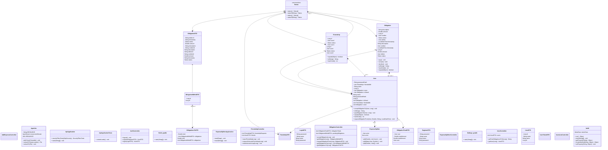

# Expense Splitter
Application for splitting expenses between multiple people.

# Project Structure

## class diagram

```mermaid
classDiagram
direction BT
class AddExpenseController
class AgentJar {
  - String RESOURCE
  - safeClose(Closeable) void
  + extractToTempLocation() File
  + extractTo(File) void
   InputStream resourceAsStream
   URL RESOURCE
}
class ApiApplication {
  + securityFilterChain(HttpSecurity) SecurityFilterChain
  + main(String[]) void
}
class ApiApplicationTests {
  ~ contextLoads() void
}
class AuthController {
  + logout() void
  + register(RegisterDTO) UserDTO
  + login(LoginDTO) UserDTO
}
class Build_gradle {
  + main(String[]) Unit
}
class ExpenseSplitter {
  - User actor
  ~ split(Double, List~User~) void
  ~ split(Map~User, Double~) void
  ~ split(Double, User[]) void
   User actor
}
class ExpenseSplitterApplication {
  + start(Stage) void
  + main(String[]) void
}
class Friendship {
  - Long id
  - User user2
  - Status status
  - User user1
  + equals(Object) boolean
  + toString() String
  + hashCode() int
   Long id
   User user1
   Status status
   User user2
}
class FriendshipController {
  + rejectFriendship(Long) void
  + requestOrAcceptFriendship(Long) void
  + markAsAutoAccept(Long) void
   List~FriendshipDTO~ friendshipRequests
   List~UserDTO~ friends
}
class FriendshipDTO
class LoginDTO {
  - String password
  - String name
   String name
   String password
}
class Obligation {
  - String description
  - Double amount
  - Long id
  - User creditor
  - Status status
  - User debtor
  - LocalDateTime timestamp
  + pay() void
  + accept() void
  + decline() void
  + toString() String
  + hashCode() int
  + equals(Object) boolean
   String description
   User creditor
   LocalDateTime timestamp
   Long id
   Double amount
   User debtor
   Status status
}
class ObligationController {
  + acceptObligation(Long) void
  + getObligation(Long) ObligationWithIdDTO
  + requestObligationFrom(Long, ObligationDTO) void
  + getObligationsFor(Long) List~ObligationWithIdDTO~
  + getObligationsTo(Long) ObligationsToDTO
   List~ObligationTotalDTO~ obligationTotals
   List~ObligationWithIdDTO~ pendingObligations
}
class ObligationDTO {
  - String debtorId
  - String timestamp
  - Status status
  - Double amount
  - String description
  - String creditorId
   String description
   String debtorId
   String creditorId
   Double amount
   String timestamp
   Status status
}
class ObligationTotalDTO {
  - User user
  - Double totalAmount
   Double totalAmount
   User user
}
class ObligationWithIdDTO {
  - Long id
   Long id
}
class ObligationsToDTO {
  - Double total
  - List~ObligationWithIdDTO~ obligations
   Double total
   List~ObligationWithIdDTO~ obligations
}
class RegisterDTO {
  - String password
  - String name
   String name
   String password
}
class RxpenseSpliitterController
class Settings_gradle {
  + main(String[]) Unit
}
class Status {
<<enumeration>>
  + values() Status[]
  + valueOf(String) Status
}
class Status {
<<enumeration>>
  + values() Status[]
  + valueOf(String) Status
}
class User {
  - String passwordHash
  - List~Friendship~ friendsWith
  - String name
  - Long id
  - List~Obligation~ owes
  - List~Obligation~ isOwed
  + acceptObligationTo(User, Long) void
  + toString() String
  + payObligationTo(User, Long) void
  + equals(Object) boolean
  + hashCode() int
  + requestObligationFrom(User, Double, String, LocalDateTime) void
   String name
   String passwordHash
   Long id
   List~Obligation~ isOwed
   List~Friendship~ friendsWith
   List~Obligation~ owes
}
class UserController {
  + getTotalObligationsToTo(Long) String
  + getUser(Long) UserDTO
   List~UserDTO~ users
}
class UserDTO {
  - Long id
  - String name
   String name
   Long id
}
class UserTokenDTO
class UsersListController
class build {
  + run() Object
  + main(String[]) void
  + getProperty(String) Object
  + invokeMethod(String, Object) Object
  + setProperty(String, Object) void
   MetaClass metaClass
}

ExpenseSplitter "1" *--> "actor 1" User 
Friendship "1" *--> "status 1" Status 
Friendship "1" *--> "user1 1" User 
FriendshipDTO "1" *--> "status 1" Status 
FriendshipDTO "1" *--> "from 1" User 
Obligation "1" *--> "status 1" Status 
Obligation "1" *--> "creditor 1" User 
ObligationDTO "1" *--> "status 1" Status 
ObligationTotalDTO "1" *--> "user 1" User 
ObligationWithIdDTO  -->  ObligationDTO 
ObligationsToDTO "1" *--> "obligations *" ObligationWithIdDTO 
Friendship  -->  Status 
Obligation  -->  Status 
User "1" *--> "friendsWith *" Friendship 
User "1" *--> "owes *" Obligation 
```